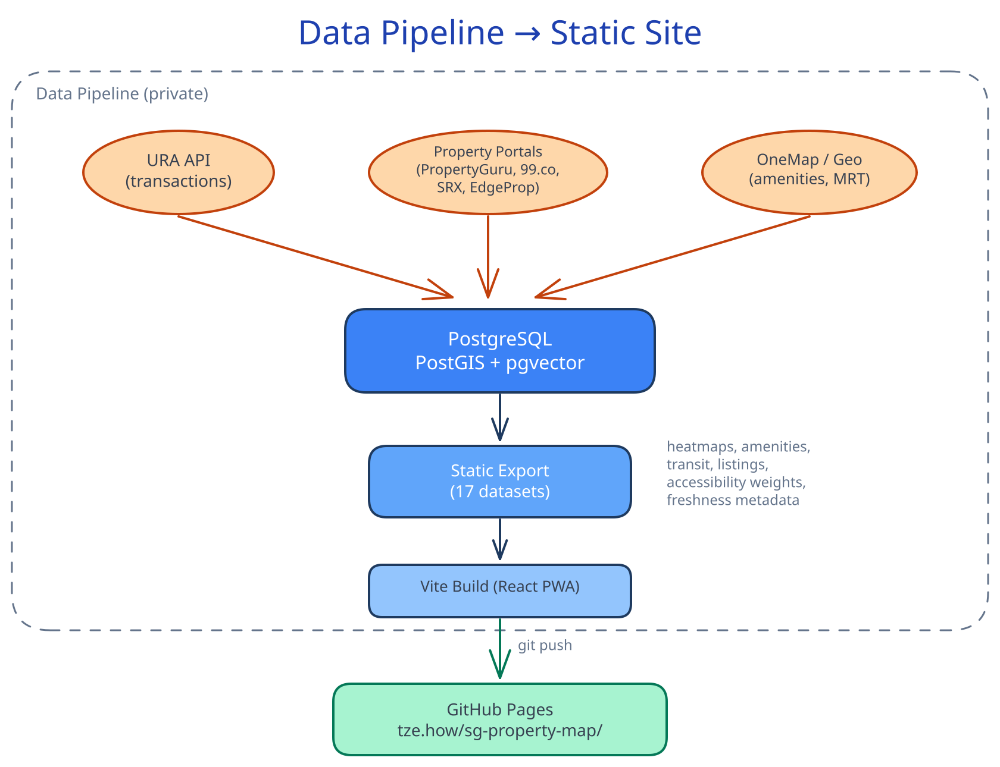
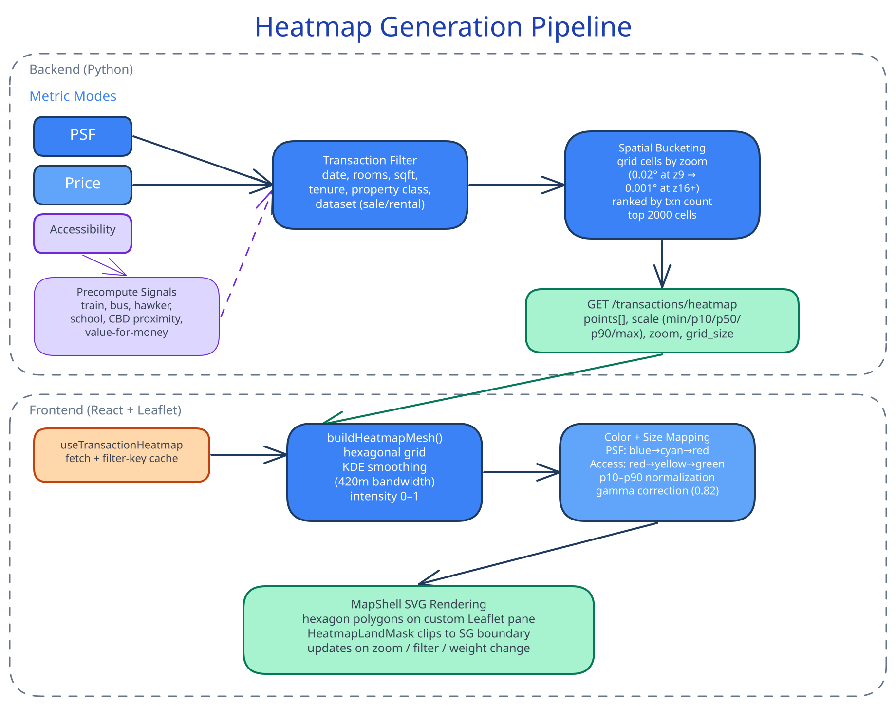

# Tze's HouseHunt

Anonymous Singapore housing-price and preference research with transaction heatmaps, place context, comparison, and explainable provenance.

> **Adopted target contract:** The checked-in runtime still contains legacy listing-mode labels, listing surfaces, and marketplace exits. Those are known implementation divergences to remove; the product description and dataset boundary below define the approved public destination.

  
  

## What is this?

A static, read-only housing-research product for Singapore that provides:

- **Transaction heatmaps** &mdash; URA resale/rental transactions colored by PSF (price per square foot), filterable by date range, property class, room count, and size
- **Geo overlays** &mdash; MRT lines, hawker centres, schools, parks, supermarkets, clinics, sports facilities, and more
- **Accessibility scoring** &mdash; composite walkability/livability heatmap based on proximity to amenities, weighted by configurable profiles (family, commuter, foodie, etc.)
- **Property comparison** &mdash; canonical residential properties compared through aligned historical transaction periods, PSF, place context, and explicit missing-data states
- **Browser-local priorities** &mdash; personal research context without accounts or server-owned public profiles
- **Evidence provenance** &mdash; dataset source, effective period or freshness, derivation basis, and limitations at the point of decision

No login is required. All analytical evidence is bundled at build time; priorities, comparison context, and saved research remain in the browser. The public contract excludes live listing search, portal monitoring, listing alerts, and marketplace exits.

## Architecture

This repository contains a **pre-built static bundle** &mdash; HTML, JS, CSS, and data files &mdash; published through an operator-controlled export, verification, build, and push workflow from the source property research system. It is deployed via GitHub Pages.

<picture>
  <source media="(prefers-color-scheme: dark)" srcset="docs/architecture_dark.svg">
  <source media="(prefers-color-scheme: light)" srcset="docs/architecture.svg">
  
</picture>

### Bundled Datasets

| Category | Datasets |
|----------|----------|
| **Heatmaps** | Transaction heatmap (combined, sale, rental), price heatmap (sale, rental), accessibility heatmap (sale, rental), filterable heatmaps, bootstrap index |
| **Geo overlays** | Amenities (hawker centres, schools, parks, clinics, etc.), transit overlay (MRT/LRT lines + stations), transport styling |
| **Property evidence** | Canonical residential properties and Sale/Rent transaction history |
| **Metadata** | Accessibility signal weights, geodata freshness timestamps |

## Heatmap Generation

The interactive heatmap is generated through a backend-to-frontend pipeline: filtered transactions are spatially bucketed on the server, then the client builds a hexagonal mesh via kernel density estimation and maps PSF/price/accessibility signals to color ramps.

<picture>
  <source media="(prefers-color-scheme: dark)" srcset="docs/heatmap-pipeline_dark.svg">
  <source media="(prefers-color-scheme: light)" srcset="docs/heatmap-pipeline.svg">
  
</picture>

## Tech Stack

- **React** + **TypeScript** (Vite)
- **Leaflet** for map rendering
- **Canvas heatmaps** with WebGL-accelerated tile rendering
- Fully client-side &mdash; no backend API calls at runtime

## Development

This is a generated output repository. To make changes, contribute to the source project and run its verified publication workflow.

## License

This project is licensed under the [GNU General Public License v3.0](LICENSE).
